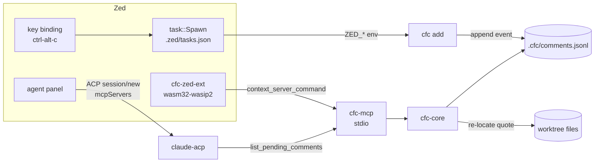

# Zed review comments for ACP agents

**Status**: executed
**Date**: 2026-08-13

## Context

Reviewing code that an AI coding agent produced currently means retyping observations into the agent panel as prose, losing the file and the line the observation was about. The goal is to leave comments anchored to file and line ranges in Zed, the way a reviewer leaves them in GitLab, GitHub, or Gerrit, and have the agent pick them up on the next turn. Zed 1.14.2 runs external agents over the Agent Client Protocol (ACP, a JSON-RPC protocol spoken over stdin and stdout), and the `claude-acp` agent is configured through the ACP registry. A Zed extension in this version can declare only themes, icon themes, languages, grammars, language servers, context servers, slash commands, snippets, and capabilities, and its WebAssembly module cannot read buffers, selections, the cursor, the command palette, or key bindings. A context server, the one capability of that list this plan uses, is a subprocess an extension tells Zed how to launch, speaking the Model Context Protocol (MCP), a tool-calling protocol an agent can call into. ACP provider extensions were deprecated in Zed v1.5.0, so an MCP context server is the extension's only live channel to an agent, and comment capture has to happen outside the extension entirely.

## Decisions made

| # | Decision | Chosen | Rejected | Rationale |
|---|----------|--------|----------|-----------|
| 1 | Delivery channel | MCP tool, explicit pull only | MCP tool plus AGENTS.md nudge, MCP resource @-mentioned, ACP proxy push | Deterministic and free of prompt-engineering fragility, at the cost of one explicit sentence per turn ([How do pending comments reach the model?](design.md#how-do-pending-comments-reach-the-model)) |
| 2 | Comment capture | Zed task bound to a key binding | In-file markers, review buffer file, CLI only | The only route that carries the file and the selection automatically, since extensions cannot read editor state ([How does a comment get authored?](design.md#how-does-a-comment-get-authored)) |
| 3 | Comment store | Append-only JSONL under the worktree at `.cfc/comments.jsonl` | Global XDG store, SQLite per worktree, tracked markdown file | Concurrent writer and reader made race-free by `O_APPEND` alone, with no dependency and a store that stays greppable ([Where do comments live?](design.md#where-do-comments-live)) |
| 4 | Anchor durability | Quoted text stored verbatim, re-located against the current file on read | Quote as hint only, git blob SHA plus diff shift, line numbers only | Reports a current line range and an explicit `drifted` state without needing the file to have been committed ([How does a comment survive the agent editing the file?](design.md#how-does-a-comment-survive-the-agent-editing-the-file)) |
| 5 | Implementation language | Rust, one cargo workspace | TypeScript with the npm host function, Python via uvx | The extension crate is forced to Rust anyway, so one workspace and one static binary avoid a second toolchain ([What is this written in?](design.md#what-is-this-written-in)) |
| 6 | Extension crate language | Rust targeting `wasm32-wasip2` | none | Forced by the platform, since Zed extensions have no other implementation language ([What is this written in?](design.md#what-is-this-written-in)) |

## Architecture



<!-- deep-plan-task-overview:begin generated: do not edit -->
## Task overview

| # | Task | Files | Deps | Summary |
|---|------|-------|------|---------|
| 1 | Spike the interactivity of a Zed task terminal | `.zed/tasks.json`, `docs/plans/zed-review-comments-mcp/design.md` | none | Establish by experiment whether a task spawned by Zed can read interactive input from the user, because no Zed documentation states either way and the whole capture design depends on it. |
| 2 | Scaffold the cargo workspace with the WASM crate excluded | `Cargo.toml`, `rust-toolchain.toml`, `.gitignore`, `crates/cfc-core/Cargo.toml`, `crates/cfc-mcp/Cargo.toml`, `crates/cfc-cli/Cargo.toml`, `crates/cfc-zed-ext/Cargo.toml` | none | Create a four-crate cargo workspace whose WebAssembly crate is excluded from the default members, so that a plain `cargo build` does not try to link the extension with the host linker. |
| 3 | Serve one MCP tool over stdio | `crates/cfc-mcp/src/main.rs`, `crates/cfc-mcp/src/server.rs`, `crates/cfc-mcp/tests/handshake.rs` | 2 | Stand up a minimal `rmcp` stdio server exposing a single `ping` tool, so that the ACP forwarding question can be answered before any real functionality is built. |
| 4 | Expose the server to Zed as a context server | `extension.toml`, `crates/cfc-zed-ext/src/lib.rs` | 3 | Add the Zed extension whose only job is telling Zed how to launch `cfc-mcp`, holding no logic of its own so that nothing here needs testing beyond the spike in task 5. |
| 5 | Spike whether an extension MCP server reaches claude-acp | `docs/plans/zed-review-comments-mcp/design.md` | 4 | Establish by experiment that a context server contributed by an extension, rather than one hand-written into settings.json, is forwarded over ACP to the external `claude-acp` agent, because Zed documents this only as servers "may be forwarded" and never distinguishes the two sources. |
| 6 | Fold an append-only event log into comment state | `crates/cfc-core/src/lib.rs`, `crates/cfc-core/src/store.rs`, `crates/cfc-core/tests/store.rs` | 2 | Give the workspace one owner of comment state, reading and writing `.cfc/comments.jsonl` as an append-only event log so that a writing CLI and a reading server never corrupt each other. |
| 7 | Re-locate each comment against the current file | `crates/cfc-core/src/anchor.rs`, `crates/cfc-core/src/lib.rs`, `crates/cfc-core/tests/anchor.rs` | 6 | Make the stored quote authoritative by searching for it in the current file at read time, so a comment still points at the right code after the agent has edited above it. |
| 8 | Capture a comment from the editor selection | `crates/cfc-cli/src/main.rs`, `crates/cfc-cli/src/range.rs`, `crates/cfc-cli/tests/range.rs` | 1, 7 | Add the `cfc` binary that turns a Zed task invocation into a stored comment, reading the selection from the environment because a multi-line value passed through `args` is not safe from re-tokenisation. |
| 9 | Replace the ping tool with the comment listing tool | `crates/cfc-mcp/src/server.rs`, `crates/cfc-mcp/tests/list_tool.rs` | 3, 7 | Swap the placeholder tool for the one the agent reads comments through, keeping the server a thin translation layer over `cfc_core::pending`. |
| 10 | Reject a resolve naming an unknown comment | `crates/cfc-mcp/src/server.rs`, `crates/cfc-mcp/tests/resolve_tool.rs` | 9 | Reject a resolve request naming a comment that does not exist, so a mistyped or hallucinated id cannot look like a successful close. |
| 11 | Record a resolve exactly once however often it is called | `crates/cfc-mcp/src/server.rs`, `crates/cfc-mcp/tests/resolve_idempotent.rs` | 10 | Implement the success path of `resolve_comment` so a resolved comment leaves the pending list and stays gone, no matter how many times the agent repeats the call. |
| 12 | Wire the key binding and document the setup | `.zed/tasks.json`, `README.md` | 5, 8, 11 | Bind the capture task to a key and write down the manual steps a fresh machine needs, since installing a dev extension and editing a user keymap cannot be automated from the repository. |
<!-- deep-plan-task-overview:end -->

## Tasks

### Task 1: Spike the interactivity of a Zed task terminal

**Target files**:
- `.zed/tasks.json` (new)
- `docs/plans/zed-review-comments-mcp/design.md` (modify)

**Change**:
Establish by experiment whether a task spawned by Zed can read interactive input from the user, because no Zed documentation states either way and the whole capture design depends on it.
- add a task labelled `cfc: stdin spike` running `sh` with args `["-c", "printf 'Comment> '; read x; printf 'got:[%s]\\n' \"$x\""]`
- set `use_new_terminal` to `true`, `reveal` to `always`, `hide` to `never`
- run it from the command palette, type text, press enter, and observe whether `got:[...]` echoes the typed text
- append a line to `design.md` under `## Implementation notes` reading `stdin spike outcome: interactive` or `stdin spike outcome: not interactive`
- if input does not round-trip, stop and re-open decision 2, because `cfc add` must then take the body from a `zed --wait` scratch buffer instead of a prompt

**Verification**:
```
grep -q 'stdin spike outcome:' docs/plans/zed-review-comments-mcp/design.md
```

**Depends on**: none

### Task 2: Scaffold the cargo workspace with the WASM crate excluded

**Target files**:
- `Cargo.toml` (new)
- `rust-toolchain.toml` (new)
- `.gitignore` (new)
- `crates/cfc-core/Cargo.toml` (new)
- `crates/cfc-mcp/Cargo.toml` (new)
- `crates/cfc-cli/Cargo.toml` (new)
- `crates/cfc-zed-ext/Cargo.toml` (new)

**Change**:
Create a four-crate cargo workspace whose WebAssembly crate is excluded from the default members, so that a plain `cargo build` does not try to link the extension with the host linker.
- root `Cargo.toml` declares `members = ["crates/*"]` and `default-members = ["crates/cfc-core", "crates/cfc-mcp", "crates/cfc-cli"]`
- `crates/cfc-zed-ext/Cargo.toml` sets `[lib] crate-type = ["cdylib"]` and depends on `zed_extension_api = "0.7.0"`
- `crates/cfc-mcp` depends on `rmcp = "3.1.2"` and `tokio` with the `rt-multi-thread` and `macros` features
- `rust-toolchain.toml` pins `channel = "1.88.0"` and lists `targets = ["wasm32-wasip2"]`
- `.gitignore` lists `/target` and `.cfc/`
- every crate sets `edition = "2024"`, required by `rmcp` 3.1.2

**Verification**:
```
cargo build --workspace && cargo build -p cfc-zed-ext --target wasm32-wasip2
```

**Depends on**: none

### Task 3: Serve one MCP tool over stdio

**Target files**:
- `crates/cfc-mcp/src/main.rs` (new)
- `crates/cfc-mcp/src/server.rs` (new)
- `crates/cfc-mcp/tests/handshake.rs` (new)

**Change**:
Stand up a minimal `rmcp` stdio server exposing a single `ping` tool, so that the ACP forwarding question can be answered before any real functionality is built.
- `server.rs` defines `struct CfcServer` implementing the `rmcp` server handler with one tool `ping` returning the fixed string `pong`
- `main.rs` serves `CfcServer` over stdio and exits 0 on a clean stream close
- the server declares MCP protocol revision `2026-07-28`

**Tests (TDD)**:
- File: `crates/cfc-mcp/tests/handshake.rs` (new)
- Test name: `initialize_then_call_ping_returns_pong`
- Behavior: a client that completes the MCP initialize handshake over stdio and calls `ping` receives `pong`.
- Level: component
- Real vs mocked: the real `cfc-mcp` binary runs as a child process over real pipes; nothing this plan owns is patched, and no MCP client is stubbed.
- Setup: local to the test, spawning the binary via `std::process::Command` with piped stdio; no shared fixture.
- Seams: none, the binary is driven through its real stdio interface.
- Dedup: nothing lower covers this; it is the first test in the crate.
- Asserts: the `initialize` response reports `protocolVersion` equal to `2026-07-28`, and the `tools/call` response for `ping` has a single text content block whose text equals `pong`.
- This test MUST fail before implementation begins. The implementation turn writes the test first, runs it (must fail), then implements, then runs again (must pass).

**Verification**:
```
cargo test -p cfc-mcp --test handshake
```

**Depends on**: 2

### Task 4: Expose the server to Zed as a context server

**Target files**:
- `extension.toml` (new)
- `crates/cfc-zed-ext/src/lib.rs` (new)

**Change**:
Add the Zed extension whose only job is telling Zed how to launch `cfc-mcp`, holding no logic of its own so that nothing here needs testing beyond the spike in task 5.
- `extension.toml` declares `id`, `name`, `version`, `schema_version = 1`, `description`, `authors`, `repository`, and a `[context_servers.comment-for-claude]` table with a `name` field
- `lib.rs` implements `zed_extension_api::Extension` with `context_server_command(&mut self, _id: &ContextServerId, _project: &Project) -> Result<Command>`
- the returned `Command` takes its program from the `CFC_MCP_BINARY` environment variable, falling back to the literal `cfc-mcp`
- `lib.rs` ends with `zed::register_extension!(CfcExtension)`
- no `capabilities` entry is added yet, matching the published `zed-mcp-server-github` extension, which spawns without one

**Verification**:
```
cargo build -p cfc-zed-ext --target wasm32-wasip2
```

**Depends on**: 3

### Task 5: Spike whether an extension MCP server reaches claude-acp

**Target files**:
- `docs/plans/zed-review-comments-mcp/design.md` (modify)

**Change**:
Establish by experiment that a context server contributed by an extension, rather than one hand-written into settings.json, is forwarded over ACP to the external `claude-acp` agent, because Zed documents this only as servers "may be forwarded" and never distinguishes the two sources.
- build the workspace, then run `zed: install dev extension` against the repository root
- open a `claude-acp` thread and ask the agent to list the MCP tools it can see
- observe whether `ping` appears, and whether calling it prompts for approval given `agent.tool_permissions.default` is already `allow`
- append a line to `design.md` under `## Implementation notes` reading `forwarding spike outcome: forwarded` or `forwarding spike outcome: not forwarded`
- if `ping` does not appear, stop and re-open decision 1, since the fallback is a settings.json `context_servers` entry pointing at the same binary, which makes the extension crate redundant

**Verification**:
```
grep -q 'forwarding spike outcome:' docs/plans/zed-review-comments-mcp/design.md
```

**Depends on**: 4

### Task 6: Fold an append-only event log into comment state

**Target files**:
- `crates/cfc-core/src/lib.rs` (new)
- `crates/cfc-core/src/store.rs` (new)
- `crates/cfc-core/tests/store.rs` (new)

**Change**:
Give the workspace one owner of comment state, reading and writing `.cfc/comments.jsonl` as an append-only event log so that a writing CLI and a reading server never corrupt each other.
- `store.rs` defines `enum Event { Add { id, file, start_row, end_row, quote, body, created_at }, Resolve { id, resolved_at } }` serialised one JSON object per line
- `Store::open(worktree_root) -> Result<Store>` creates `.cfc/` when absent
- `Store::append(&self, event: &Event)` opens with `OpenOptions::append(true)` per call and writes one line ending in a newline
- `Store::fold(&self) -> Result<Vec<Comment>>` replays the log, drops any comment carrying a later `Resolve`, and returns the survivors in insertion order
- a line that fails to parse is skipped rather than failing the whole read, so a torn final line from a killed process cannot brick the store
- `Comment::new_id()` derives an id from a counter over existing events, keeping ids short and stable

**Tests (TDD)**:
- File: `crates/cfc-core/tests/store.rs` (new)
- Test name: `fold_drops_resolved_and_skips_torn_lines`
- Behavior: folding a log containing an added comment, a second added comment, a resolve for the first, and a truncated trailing line yields only the second comment.
- Level: unit
- Real vs mocked: a real temporary directory and a real file on disk; the filesystem is not faked because `O_APPEND` semantics are the thing under test.
- Setup: local to the test, writing the four lines directly into `.cfc/comments.jsonl` under a `tempfile::TempDir`.
- Seams: none, the store is driven through `open` and `fold`.
- Dedup: nothing lower covers this; it is the first test in the crate.
- Asserts: `fold()` returns a vector of length 1 whose single element has the id of the second comment, and the call returns `Ok` rather than an error despite the torn line.
- This test MUST fail before implementation begins. The implementation turn writes the test first, runs it (must fail), then implements, then runs again (must pass).

**Verification**:
```
cargo test -p cfc-core --test store
```

**Depends on**: 2

### Task 7: Re-locate each comment against the current file

**Target files**:
- `crates/cfc-core/src/anchor.rs` (new)
- `crates/cfc-core/src/lib.rs` (modify)
- `crates/cfc-core/tests/anchor.rs` (new)

**Change**:
Make the stored quote authoritative by searching for it in the current file at read time, so a comment still points at the right code after the agent has edited above it.
- `anchor.rs` defines `enum Anchor { Anchored { start_row, end_row }, Drifted { start_row_when_written } }`
- `locate(quote: &str, file_text: &str, hint_row: usize) -> Anchor` searches for the quote as a contiguous run of lines, comparing lines with trailing whitespace trimmed so reindentation alone does not count as drift
- when the quote occurs more than once, the occurrence nearest `hint_row` wins
- when the quote does not occur, the result is `Drifted`, never a guess
- `lib.rs` exposes one entry point `pending(worktree_root) -> Result<Vec<AnchoredComment>>` that folds the log and anchors each survivor, so callers never see events, folding, or file reads
- a comment whose file no longer exists is returned as `Drifted`

**Tests (TDD)**:
- File: `crates/cfc-core/tests/anchor.rs` (new)
- Test name: `locate_follows_shifted_quote_and_reports_drift_when_gone`
- Behavior: a quote that moved down the file is reported at its new rows, and a quote that no longer occurs is reported as drifted.
- Level: unit
- Real vs mocked: pure function over in-memory strings; nothing mocked because nothing is injected.
- Setup: local to the test, two string literals for the file text and one for the quote.
- Seams: none.
- Dedup: the store test already covers folding, so this test must not re-assert resolve semantics.
- Asserts: two named cases, each asserted separately so a failure names which rule broke. The shifted case asserts `locate` returns `Anchor::Anchored` with `start_row` equal to the quote's new first row. The removed case asserts it returns `Anchor::Drifted` carrying the original row.
- This test MUST fail before implementation begins. The implementation turn writes the test first, runs it (must fail), then implements, then runs again (must pass).

**Verification**:
```
cargo test -p cfc-core --test anchor
```

**Depends on**: 6

### Task 8: Capture a comment from the editor selection

**Target files**:
- `crates/cfc-cli/src/main.rs` (new)
- `crates/cfc-cli/src/range.rs` (new)
- `crates/cfc-cli/tests/range.rs` (new)

**Change**:
Add the `cfc` binary that turns a Zed task invocation into a stored comment, reading the selection from the environment because a multi-line value passed through `args` is not safe from re-tokenisation.
- `cfc add` reads `CFC_FILE`, `CFC_ROW`, and `CFC_SELECTION` from the environment, all populated from `ZED_*` variables by the task definition
- `range.rs` defines `derive_range(cursor_row: usize, selection: &str) -> (usize, usize)`, since Zed exposes no selection start and end rows
- `derive_range` treats `cursor_row` as one endpoint and spans `selection.lines().count()` rows, clamping the start at row 1 so an upward selection cannot produce a zero or negative row
- an empty selection yields the single row `(cursor_row, cursor_row)`
- the comment body is read from stdin, prompted with `Comment> `, and an empty body aborts without writing
- `cfc list` prints pending comments with their anchored or drifted state, and `cfc resolve <id>` appends a resolve event

**Tests (TDD)**:
- File: `crates/cfc-cli/tests/range.rs` (new)
- Test name: `derive_range_spans_selection_and_clamps_at_first_row`
- Behavior: a selection of several lines produces a range spanning those lines, and a selection reaching above the first row starts at row 1 rather than underflowing.
- Level: unit
- Real vs mocked: pure function over a string and an integer; nothing mocked.
- Setup: local to the test, with each literal bound to a named constant saying why it was chosen: `MID_FILE_ROW = 10` is far enough from the top that no clamping can occur, `THREE_LINE_SELECTION` spans 3 rows, `NEAR_TOP_ROW = 2` with `FOUR_LINE_SELECTION` is the one combination whose unclamped start would fall below row 1.
- Seams: none, and no seam is added for stdin because the body prompt is not what this test covers.
- Dedup: the store and anchor tests already cover persistence and re-location, so this test must assert only the row arithmetic.
- Asserts: two named cases, each asserted separately so a failure names which rule broke. The spanning case asserts `derive_range(MID_FILE_ROW, THREE_LINE_SELECTION)` returns a pair spanning exactly 3 rows that includes row 10. The clamping case asserts `derive_range(NEAR_TOP_ROW, FOUR_LINE_SELECTION)` returns a pair whose first element is 1.
- This test MUST fail before implementation begins. The implementation turn writes the test first, runs it (must fail), then implements, then runs again (must pass).

**Verification**:
```
cargo test -p cfc-cli --test range
```

**Depends on**: 1, 7

### Task 9: Replace the ping tool with the comment listing tool

**Target files**:
- `crates/cfc-mcp/src/server.rs` (modify)
- `crates/cfc-mcp/tests/list_tool.rs` (new)

**Change**:
Swap the placeholder tool for the one the agent reads comments through, keeping the server a thin translation layer over `cfc_core::pending`.
- `list_pending_comments` takes no arguments and returns one entry per pending comment with `id`, `file`, `lines`, `status`, `quote`, and `body`
- `status` is the string `anchored` or `drifted`, and a drifted entry reports `lines_when_written` instead of `lines`
- the tool description states that the quote is authoritative and the line numbers are advisory
- the worktree root comes from the process working directory, which Zed sets to the project root when it spawns the server
- the `ping` tool is deleted

**Tests (TDD)**:
- File: `crates/cfc-mcp/tests/list_tool.rs` (new)
- Test name: `list_pending_comments_maps_anchor_state_to_field_set`
- Behavior: each listed comment carries the field set its anchor state calls for, `lines` when the quote was found and `lines_when_written` when it was not.
- Level: component
- Real vs mocked: the real server binary over real pipes against a real temporary worktree; `cfc-core` runs for real because the translation is the only thing worth isolating.
- Setup: local to the test, a `tempfile::TempDir` holding one source file and a `.cfc/comments.jsonl` with two `Add` events, one whose quote appears in that file and one whose quote does not.
- Seams: none, the server is driven through its stdio interface with its working directory set to the temporary worktree.
- Dedup: task 7 already covers the locate algorithm, so this test must not re-assert which rows a quote resolves to, only which fields the result carries.
- Asserts: the `tools/call` result for `list_pending_comments` contains exactly two entries. The entry whose quote was found has `status` equal to `anchored`, carries `lines`, and carries no `lines_when_written`. The other has `status` equal to `drifted`, carries `lines_when_written`, and carries no `lines`.
- This test MUST fail before implementation begins. The implementation turn writes the test first, runs it (must fail), then implements, then runs again (must pass).

**Verification**:
```
cargo test -p cfc-mcp --test list_tool
```

**Depends on**: 3, 7

### Task 10: Reject a resolve naming an unknown comment

**Target files**:
- `crates/cfc-mcp/src/server.rs` (modify)
- `crates/cfc-mcp/tests/resolve_tool.rs` (new)

**Change**:
Reject a resolve request naming a comment that does not exist, so a mistyped or hallucinated id cannot look like a successful close.
- `resolve_comment` takes a required string argument `id`
- an unknown `id` returns an MCP error result rather than succeeding silently, because a silent success would mislead the agent into thinking a comment had been closed when no comment was touched
- the tool description states that the agent should resolve a comment only after the change it asked for has been made
- the recording of a resolve for a known id is task 11, so this task leaves the success path unimplemented

**Tests (TDD)**:
- File: `crates/cfc-mcp/tests/resolve_tool.rs` (new)
- Test name: `resolve_comment_errors_on_unknown_id`
- Behavior: calling `resolve_comment` with an id that appears in no `Add` event returns an error result and writes nothing to the log.
- Level: component
- Real vs mocked: the real server binary over real pipes against a real temporary worktree; `cfc-core` runs for real because the id lookup is the behavior under test.
- Setup: local to the test, a `tempfile::TempDir` whose `.cfc/comments.jsonl` holds one `Add` event with a known id, and the call uses a different id.
- Seams: none, the server is driven through its stdio interface with its working directory set to the temporary worktree.
- Dedup: task 6 already covers folding and task 9 covers the listing shape, so this test must assert only the unknown-id rejection.
- Asserts: the `tools/call` response for `resolve_comment` is an error result rather than a success, and the byte length of `.cfc/comments.jsonl` is unchanged from before the call.
- This test MUST fail before implementation begins. The implementation turn writes the test first, runs it (must fail), then implements, then runs again (must pass).

**Verification**:
```
cargo test -p cfc-mcp --test resolve_tool
```

**Depends on**: 9

### Task 11: Record a resolve exactly once however often it is called

**Target files**:
- `crates/cfc-mcp/src/server.rs` (modify)
- `crates/cfc-mcp/tests/resolve_idempotent.rs` (new)

**Change**:
Implement the success path of `resolve_comment` so a resolved comment leaves the pending list and stays gone, no matter how many times the agent repeats the call.
- a known `id` appends one `Resolve` event through `cfc_core` and returns a success result
- a second call naming an already resolved id returns success without appending a second event, since an agent that retries must not grow the log without bound
- `cfc_core` gains `Store::is_pending(id)` so the server can tell an unknown id from an already resolved one without reimplementing the fold

**Tests (TDD)**:
- File: `crates/cfc-mcp/tests/resolve_idempotent.rs` (new)
- Test name: `resolve_comment_records_one_event_however_often_called`
- Behavior: resolving the same known id twice removes the comment from the pending list and appends exactly one `Resolve` event.
- Level: component
- Real vs mocked: the real server binary over real pipes against a real temporary worktree; `cfc-core` runs for real because the append and the fold are jointly the behavior under test.
- Setup: local to the test, a `tempfile::TempDir` whose `.cfc/comments.jsonl` holds one `Add` event with a known id.
- Seams: none, the server is driven through its stdio interface with its working directory set to the temporary worktree.
- Dedup: task 10 already covers the unknown-id rejection and task 6 covers folding, so this test must assert only that a repeat call is absorbed.
- Asserts: both `resolve_comment` calls return success results, a following `list_pending_comments` returns zero entries, and `.cfc/comments.jsonl` contains exactly one line whose event type is `Resolve`.
- This test MUST fail before implementation begins. The implementation turn writes the test first, runs it (must fail), then implements, then runs again (must pass).

**Verification**:
```
cargo test -p cfc-mcp --test resolve_idempotent
```

**Depends on**: 10

### Task 12: Wire the key binding and document the setup

**Target files**:
- `.zed/tasks.json` (modify)
- `README.md` (new)

**Change**:
Bind the capture task to a key and write down the manual steps a fresh machine needs, since installing a dev extension and editing a user keymap cannot be automated from the repository.
- replace the spike task with `cfc: comment on selection`, running the `cfc` binary with `["add"]`
- pass the editor state through `env` rather than `args`, mapping `CFC_FILE` to `$ZED_RELATIVE_FILE`, `CFC_ROW` to `$ZED_ROW`, and `CFC_SELECTION` to `$ZED_SELECTED_TEXT`
- set `use_new_terminal` to `true`, `reveal` to `always` so the pane can take keystrokes, and `hide` to `on_success`
- `README.md` documents the keymap entry `["task::Spawn", { "task_name": "cfc: comment on selection" }]` under `"context": "Editor"`, chosen over `"Workspace"` so the binding fires only where a selection exists
- `README.md` documents `cargo install --path crates/cfc-cli`, setting `CFC_MCP_BINARY`, running `zed: install dev extension`, and the sentence to type at the agent, `check my review comments`
- `README.md` states that comments are pulled only when asked, and that `.cfc/` is git-ignored

**Verification**:
```
python3 -c "import json;t=json.load(open('.zed/tasks.json'));assert any(x['label']=='cfc: comment on selection' and 'CFC_SELECTION' in x['env'] for x in t)"
```

**Depends on**: 5, 8, 11

## References

- `~/.config/zed/settings.json` (the `agent_servers.claude-acp` and `agent.tool_permissions` entries this design assumes)
- `~/.config/zed/keymap.json` (where the capture binding is added)
- `~/.local/share/zed/extensions/index.json` (the normalised extension manifest schema for Zed 1.14.2)
- https://zed.dev/docs/extensions/mcp-extensions
- https://zed.dev/docs/ai/mcp
- https://zed.dev/docs/ai/external-agents
- https://zed.dev/docs/extensions/agent-servers
- https://zed.dev/docs/extensions/developing-extensions
- https://zed.dev/docs/tasks
- https://docs.rs/zed_extension_api/0.7.0/zed_extension_api/trait.Extension.html
- https://github.com/LoamStudios/zed-mcp-server-github/blob/main/extension.toml
- https://github.com/zed-industries/zed/issues/13478
- https://github.com/modelcontextprotocol/rust-sdk
- https://modelcontextprotocol.io/specification

## Open questions

- none
